|  |  |
| -------- | --- |
| **Nama** | Tedi Mulyadi |
| **NIM** | 312510163 |
| **Kelas** | TI.25.A2 |
| **Mata Kuliah** | Pengantar Pemrograman |
| **Dosen** | Agung Nugroho, S.Kom., M.Kom. |  

------------------------------------------------------------------------ 

### Modul Praktikum: Penanganan Eksepsi dalam Python  

## 1. Tujuan Praktikum  

Setelah menyelesaikan modul ini, mahasiswa diharapkan mampu:  

1. Memahami konsep runtime error dan perbedaannya dengan syntax error.  

2. Menerapkan blok try-except untuk menangani kesalahan program agar tidak berhenti secara tiba-tiba.  

3. Menangani berbagai jenis eksepsi secara spesifik (seperti ValueError, ZeroDivisionError).  

4. Menggunakan klausa else dan finally untuk struktur logika yang lebih robust.  

5. Membuat dan memicu (raise) eksepsi sendiri.  

## 2. Dasar Teori  

&nbsp;&nbsp;&nbsp;&nbsp;Dalam pemrograman, kesalahan sering terjadi saat *runtime* (saat program berjalan), seperti pembagian dengan nol atau mencoba mengakses indeks list yang tidak ada. Python menyediakan mekanisme standar yang disebut **Exception Handling** untuk menangani situasi ini. Pendekatan Python sering disebut **EAFP** *(Easier to Ask for Forgiveness than Permission)*, dimana kita mencoba menjalankan kode terlebih dahulu di dalam blok try, dan jika gagal, kita "meminta maaf" atau menanganinya di blok except2. Ini berbeda dengan pendekatan **LBYL** *(Look Before You Leap)* yang menggunakan banyak pengecekan if sebelum melakukan aksi.  

Struktur umum blok penanganan eksepsi adalah:  
```python
try:
# Kode yang mungkin menimbulkan error
except NamaEksepsi:
# Kode penanganan error
else:
# Dijalankan jika TIDAK ada error pada blok try
finally:
# Selalu dijalankan, baik ada error maupun tidak
```
## 3. Langkah-Langkah Praktikum  

### Percobaan 1: Mengamati Runtime Error  

Sebelum menangani error, kita harus melihat bagaimana error menghentikan program.  

1. Buat file baru bernama percobaan1.py  

2. Ketik kode berikut yang meminta input pengguna untuk pembagian bilangan:  
Python  

```python
print('Silakan masukkan dua angka untuk pembagian.')
num1 = int(input('Masukkan angka yang akan dibagi: '))
num2 = int(input('Masukkan angka pembagi: '))
print('{0} dibagi {1} = {2}'.format(num1, num2, num1/num2))
```  

3. Jalankan program. Masukkan angka pembagi 0.  

4. **Analisis:** Program akan berhenti mendadak dan menampilkan pesan *Traceback* dengan *error ZeroDivisionError*: *division by zero*.  

### Output  

- Percobaan dengan nilai benar  
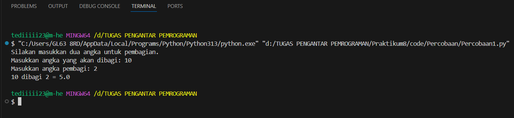  

- Percobaan dengan nilai error  
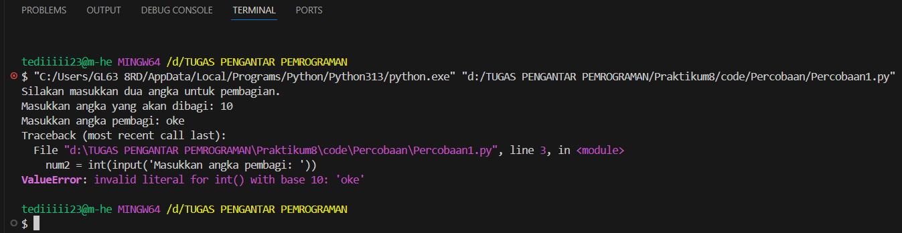  

## Percobaan 2: Penanganan Error Sederhana (try-except)  

Kita akan mencegah program crash menggunakan blok try-except.  

1. Modifikasi kode percobaan1.py menjadi seperti berikut:
Python
``` python
print('Silakan masukkan dua angka untuk pembagian.')
try:
num1 = int(input('Masukkan angka yang akan dibagi: '))
num2 = int(input('Masukkan angka pembagi: '))
print('{0} dibagi {1} = {2}'.format(num1, num2, num1/num2))
except ZeroDivisionError:
print('Error: Tidak bisa membagi bilangan dengan nol.')
```  

2. Jalankan kembali dan masukkan pembagi 0.  

3. **Analisis:** Program tidak lagi menampilkan pesan error merah yang menakutkan, melainkan pesan sopan yang kita tentukan. Eksekusi program lompat ke blok except saat error terjadi.  

### Output  

- Percobaan dengan nilai benar  
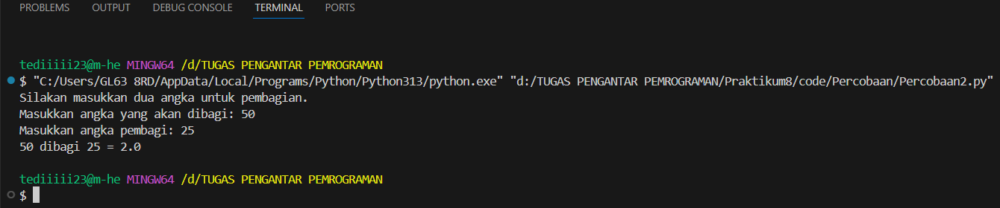  

- Percobaan dengan nilai error  
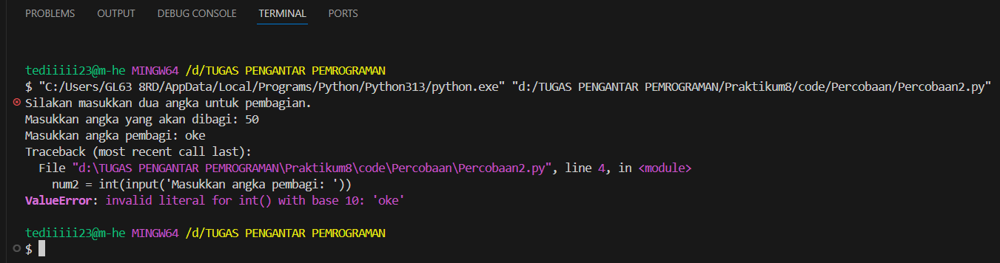  

## Percobaan 3: Menangani Berbagai Tipe Eksepsi
Selain pembagian nol, pengguna mungkin memasukkan teks (bukan angka), yang akan menyebabkan ValueError.  

1. Buat file percobaan3.py. Kita akan menangani dua jenis error sekaligus.
Python
``` python
try:
val = int(input("Masukkan sebuah bilangan bulat positif: "))
print("Anda memasukkan:", val)

hasil = 10 / val
print("10 dibagi angka tersebut adalah:", hasil)
except ValueError:
print("Input salah! Pastikan Anda memasukkan angka, bukan huruf.")
except ZeroDivisionError:
print("Input salah! Angka tidak boleh nol.")
except Exception as e:
print(f"Terjadi error yang tidak diketahui: {e}")
```  

2. Uji Coba:  

- Masukkan huruf (misal: "satu") -> Akan ditangkap oleh except ValueError.  

- Masukkan angka 0 -> Akan ditangkap oleh except ZeroDivisionError.  

- Masukkan angka 5 -> Program berjalan normal.  

### Output  

- Percobaan dengan nilai benar  
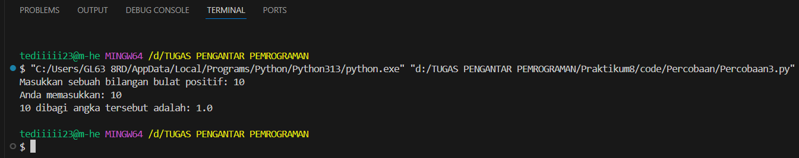  

- Percobaan dengan nilai error  
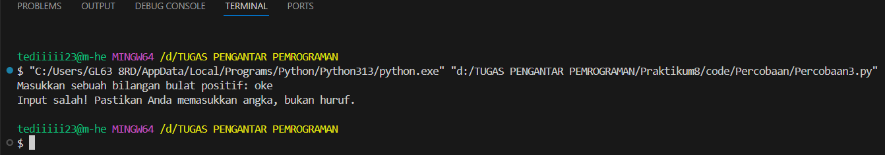  

**Catatan**: except Exception adalah penangkap umum *(catch-all)* untuk error yang tidak terduga, sebaiknya diletakkan di urutan terakhir.  

## Percobaan 4: Menggunakan Klausa else dan finally  

Klausa else berjalan jika tidak ada eksepsi, sedangkan finally selalu berjalan (biasanya untuk bersih-bersih memori atau menutup file).  

1. Buat file percobaan4.py:
Python
```python
try:
x = int(input("Masukkan angka: "))
except ValueError:
print("Itu bukan angka!")
else:
print(f"Terima kasih, Anda memasukkan angka {x}")
# Logika lanjutan yang aman dijalankan jika input benar
finally:
print("Sesi input selesai (blok finally selalu dieksekusi).")
```
2. Jalankan program dengan input benar dan input salah untuk melihat bedanya.  

### Output  

- Percobaan dengan nilai benar  
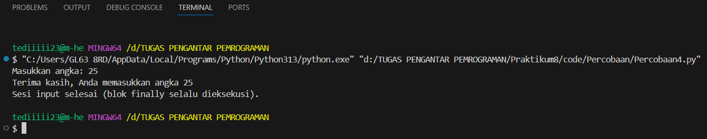  

- Percobaan dengan nilai error  
  

## Percobaan 5: Mengakses Objek Eksepsi  

Terkadang kita ingin melihat detail pesan error asli dari sistem namun tetap menanganinya. Kita gunakan kata kunci as.  

1. Buat file percobaan5.py:
Python
```python
try:
daftar_angka = [1, 2, 3]

indeks = int(input("Masukkan indeks yang ingin diakses (0-2): "))
print("Nilai:", daftar_angka[indeks])
except IndexError as e:
print("Terjadi IndexError. Pesan sistem:", e)
except ValueError as e:
print("Terjadi ValueError. Pesan sistem:", e)
```
2. Cobalah mengakses indeks 5. Pesan error asli list index out of range akan tersimpan dalam variabel e.  

### Output  

- Percobaan dengan nilai benar  
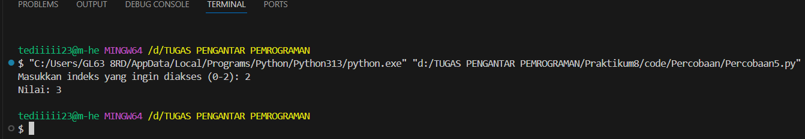  

- Percobaan dengan nilai error  
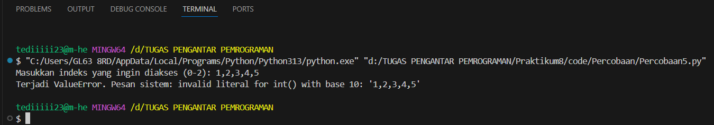  

## Percobaan 6: Memicu Eksepsi Sendiri (raise)  

Kita bisa memaksakan error terjadi jika kondisi tertentu tidak terpenuhi, menggunakan perintah raise.  

1. Buat file percobaan6.py:
Python
```python
def cek_level(level):
if level < 1:
raise ValueError("Level tidak valid! Harus minimal 1.")
print(f"Level {level} diterima.")
try:
lvl = int(input("Masukkan level karakter: "))
cek_level(lvl)
except ValueError as e:
print("Peringatan:", e)
```  
2. Masukkan angka -5. Fungsi akan "melempar" error yang kemudian "ditangkap" oleh blok except.  

### Output  

- Percobaan dengan nilai benar  
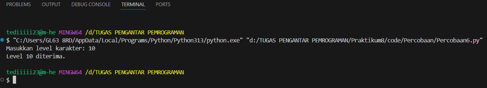  

- Percobaan dengan nilai error  
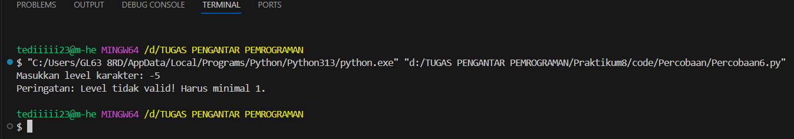  

------------------------------------------------------------------------  

## 4. LATIHAN MANDIRI(Tugas)  

Kerjakan latihan berikut untuk menguji pemahaman Anda.  

### Latihan 1: Kalkulator Aman  

Buatlah program kalkulator sederhana yang meminta dua angka dan satu operator (+, -, *, /) dari pengguna.  

- Gunakan try-except untuk menangani input yang bukan angka (ValueError).

- Gunakan try-except untuk menangani pembagian dengan nol(ZeroDivisionError).  

- Jika operator tidak valid (misal user memasukkan ^), gunakan raise Exception untuk memunculkan pesan error kustom.  

### Program  

```python
try:
    # Meminta input angka dari pengguna
    angka1 = float(input("Masukkan angka pertama: "))
    angka2 = float(input("Masukkan angka kedua : "))
    
    # Meminta input operator
    operator = input("Masukkan operator (+, -, *, /): ")

    # Mengecek operator valid
    if operator not in ['+', '-', '*', '/']:
        raise Exception("Operator tidak valid! Gunakan hanya +, -, *, atau /.")

    # Melakukan operasi
    if operator == '+':
        hasil = angka1 + angka2
    elif operator == '-':
        hasil = angka1 - angka2
    elif operator == '*':
        hasil = angka1 * angka2
    elif operator == '/':
        # Menangani pembagian dengan nol
        try:
            hasil = angka1 / angka2
        except ZeroDivisionError:
            print("Error: Tidak dapat membagi dengan nol!")
            exit()

    print(f"Hasil: {hasil}")

# Menangani input bukan angka
except ValueError:
    print("Error: Input harus berupa angka!")

# Menangani error operator kustom
except Exception as e:
    print("Error:", e)

```  
### Output  

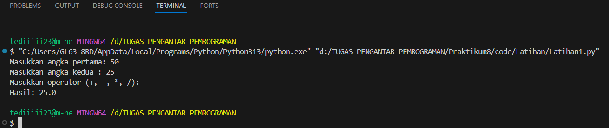  

## Penjelasan Program Kalkulator Aman

&nbsp;&nbsp;&nbsp;&nbsp;Program ini meminta **dua angka** dan **satu operator** dari pengguna, lalu menghitung hasilnya. Program dilengkapi dengan **penanganan error (exception handling)** agar tidak mudah crash.

1. Try utama  

``` python
try:
    angka1 = float(input("Masukkan angka pertama: "))
    angka2 = float(input("Masukkan angka kedua : "))
```

- Program mencoba mengambil input pengguna dan mengubah menjadi float.
- Jika pengguna memasukkan selain angka (misal: "abc"), akan terjadi ValueError dan ditangkap oleh blok except.

2. Input operator  

```python
operator = input("Masukkan operator (+, -, *, /): ")
```

- Pengguna memasukkan operator yang ingin digunakan: **+, -, *, atau /**.

3. Mengecek apakah operator valid  

``` python
if operator not in ['+', '-', '*', '/']:
    raise Exception("Operator tidak valid! Gunakan hanya +, -, *, atau /.")
```

- Jika operator selain daftar di atas **(misal ^, %, &)**, program akan memunculkan exception buatan sendiri menggunakan *raise Exception*.

4. Melakukan operasi matematika  

``` python
if operator == '+':
    hasil = angka1 + angka2
elif operator == '-':
    hasil = angka1 - angka2
elif operator == '*':
    hasil = angka1 * angka2
elif operator == '/':
```

- Di sini program menentukan operasi apa yang harus dilakukan berdasarkan operator.

5. Menangani pembagian dengan no (ZeroDivisionError)  

``` python
try:
    hasil = angka1 / angka2
except ZeroDivisionError:
    print("Error: Tidak dapat membagi dengan nol!")
    exit()
```

- Jika angka kedua adalah 0, maka terjadi ZeroDivisionError.
- Program menampilkan pesan error dan keluar agar tidak melanjutkan perhitungan.  

6. Output hasil  

``` python
print(f"Hasil: {hasil}")
```

- Jika semua input valid dan tidak ada error, hasil ditampilkan.  

7. Menangani ValueError  

```python
except ValueError:
    print("Error: Input harus berupa angka!")
```  

- Menangkap kesalahan jika input angka bukan angka sebenarnya.

8. Menangani error lainnya (operator tidak valid)  

``` python
except Exception as e:
    print("Error:", e)
```

- Menangkap error dari raise Exception untuk operator tidak valid.
- Pesan error akan ditampilkan sesuai teks yang dibuat.  

------------------------------------------------------------------------  

## Latihan 2: Validasi Daftar Nilai  

Diberikan sebuah list nilai mahasiswa: nilai = [80, 90, 'A', 70, 100, 'B']. Buatlah program yang melakukan iterasi (looping) pada list tersebut untuk menghitung rata-rata nilai.

- Karena ada data berupa string ('A', 'B'), program akan error jika langsung dijumlahkan.  

- Gunakan try-except di dalam loop untuk melewati (skip) data yang bukan angka tanpa menghentikan program.  

- Tampilkan rata-rata dari data yang valid saja.  

### Program  

```python
nilai = [80, 90, 'A', 70, 100, 'B']

total = 0
jumlah_valid = 0

for n in nilai:
    try:
        # Coba ubah menjadi angka
        angka = float(n)
        total += angka
        jumlah_valid += 1
    except ValueError:
        # Jika bukan angka, skip
        print(f"Data '{n}' dilewati (bukan angka).")
        continue

# Hitung rata-rata jika ada data valid
if jumlah_valid > 0:
    rata_rata = total / jumlah_valid
    print(f"\nRata-rata nilai valid: {rata_rata}")
else:
    print("Tidak ada nilai valid.")
```
### Output  

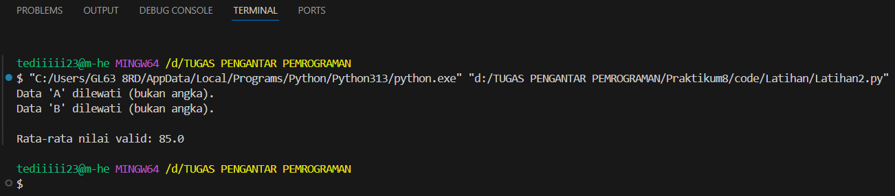  

## Penjelasan Program Validasi Daftar Nilai  

Program ini mengambil sebuah list:  

```python
nilai = [80, 90, 'A', 70, 100, 'B']
```  

- List berisi **campuran angka dan huruf**, sehingga kita perlu memproses hanya data yang valid (angka), dan melewati data yang tidak valid (string).

1. Inisialisasi variabel  

```python
total = 0
jumlah_valid = 0
```  

- total → untuk menyimpan jumlah seluruh nilai yang valid.  

- jumlah_valid → menghitung berapa banyak nilai valid yang berhasil diproses tanpa variabel ini, kita tidak bisa menghitung rata-rata.  

2. Perulangan (loop) pada list  

```python
for n in nilai:
```  
- Program melakukan iterasi pada setiap elemen dalam list nilai.  

3. Validasi angka dengan try-except  

``` python
try:
    angka = float(n)
    total += angka
    jumlah_valid += 1
except ValueError:
    print(f"Data '{n}' dilewati (bukan angka).")
    continue
```

### Penjelasan:  

1. try:  

Program mencoba mengubah setiap elemen menjadi angka (float(n)). Jika elemen benar (contoh: 80, 90, 70, 100), maka:  

- Nilai dianggap valid.

- Ditambahkan ke *total*.

- jumlah_valid bertambah.

2. except ValueError:  

Jika elemennya berupa huruf (contoh: 'A', 'B'), Python tidak bisa mengubahnya menjadi angka → menyebabkan ValueError.  

Ketika error muncul:  

- Program menampilkan pesan bahwa data dilewati.  

- Perulangan lanjut ke elemen berikutnya.  

- Program tidak berhenti, tetap berjalan.  

- Ini sesuai instruksi: *"skip data yang bukan angka tanpa menghentikan program."*

4. Menghitung rata-rata  

```python
if jumlah_valid > 0:
    rata_rata = total / jumlah_valid
    print(f"\nRata-rata nilai valid: {rata_rata}")
else:
    print("Tidak ada nilai valid.")
```  

Karena tidak semua data valid, kita hanya menghitung rata-rata dari nilai yang berhasil diproses:  

- Nilai valid adalah: 80, 90, 70, 100

- Total = 340

- Jumlah valid = 4

- Rata-rata = 340 / 4 = 85.0

Jika tidak ada nilai valid sama sekali, akan muncul pesan *"Tidak ada nilai valid."*